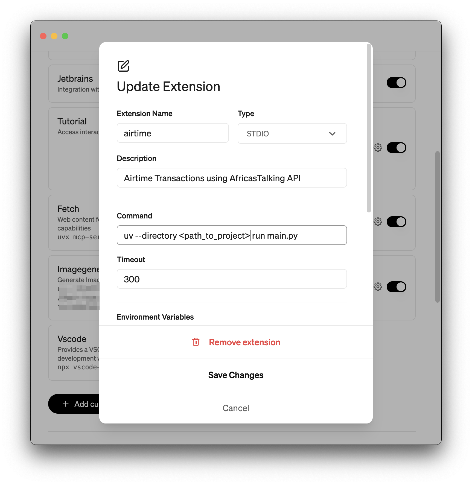
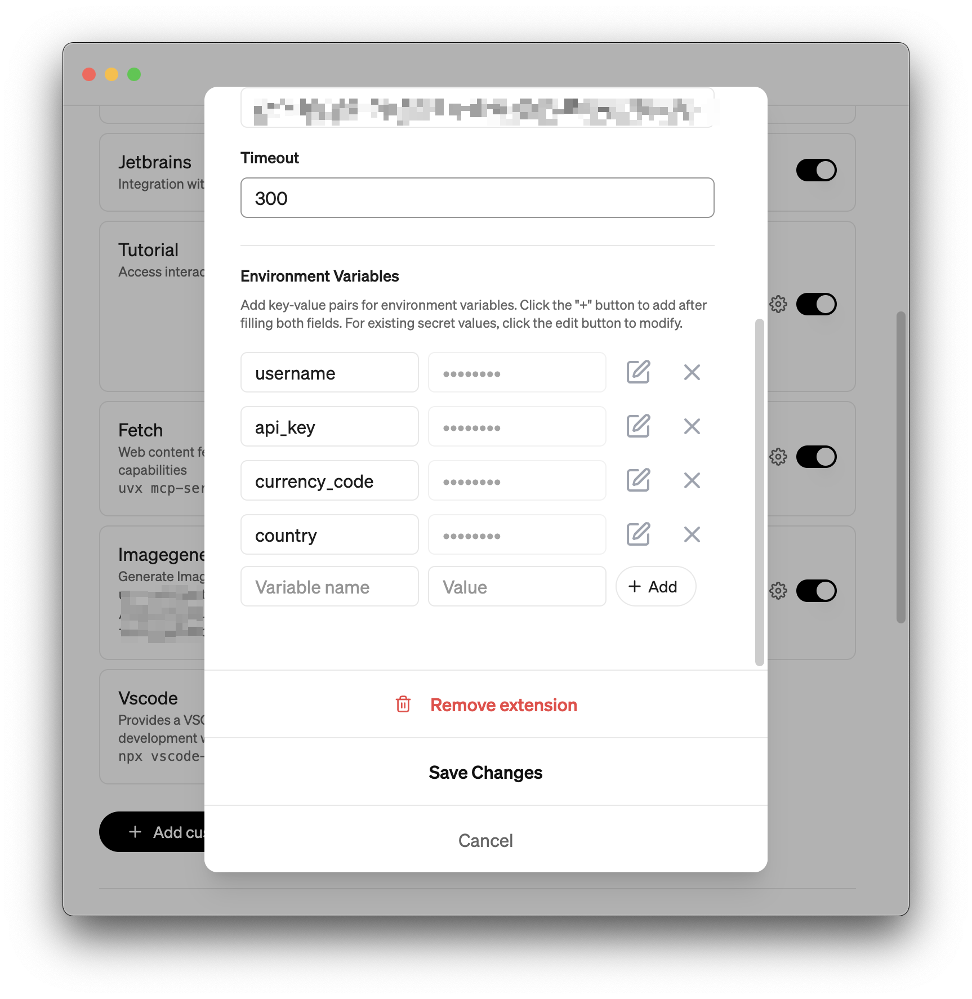

# Africa's Talking Airtime MCP
[](https://mseep.ai/app/nasoma-africastalking-airtime-mcp)
[](https://smithery.ai/server/@nasoma/africastalking-airtime-mcp)
<a href="https://glama.ai/mcp/servers/@nasoma/africastalking-airtime-mcp">
  
</a>
[](https://mseep.ai/app/f5bd5826-abe0-421e-ac2b-6a5daeaa384a)

This project implements a **Model Context Protocol (MCP) server** that enables seamless interaction with the **Africa's Talking API** for airtime-related operations. It provides a suite of tools for checking account balances, sending airtime, viewing transaction history, and summarizing top-up data. The server uses an SQLite database for persistent storage and includes logic for formatting phone numbers for various African countries.

## Key Features

- **Check Balance**: Instantly retrieve the current airtime balance of your Africa's Talking account.
- **Send Airtime**: Load airtime to any phone number in supported countries.
- **Transaction Logging**: Automatically save every transaction to a local SQLite database.
- **Transaction History**: View a list of the most recent top-up transactions.
- **Summarize Top-ups**: Calculate the total amount of the last 'n' top-ups.
- **Count Top-ups**: Count the number of transactions for a specific phone number.
- **Phone Number Formatting**: Automatically formats phone numbers to include the correct country code.

## Installation Guide

### Prerequisites

1. **Python 3.10 or higher**: Ensure you have a modern version of Python installed.
2. **`uv` Package Manager**: This project uses `uv` for dependency management. Install it by running:
   ```bash
   curl -LsSf https://astral.sh/uv/install.sh | sh
   ```

### Installing from Smithery

To install Africa's Talking Airtime Server for Claude Desktop automatically via [Smithery](https://smithery.ai/server/@nasoma/africastalking-airtime-mcp):

```bash
npx -y @smithery/cli install @nasoma/africastalking-airtime-mcp --client claude
```

### Local Setup

1. **Clone the Repository**:
   ```bash
   git clone https://github.com/nasoma/africastalking-airtime-mcp.git
   cd africastalking-airtime-mcp
   ```

2. **Install Dependencies**:
   Set up the virtual environment and install the required packages using `uv`:
   ```bash
   uv sync
   ```

## Using with AI Tools

### With Claude Desktop

Add this to your `claude_desktop_config.json`:
```json
{
  "mcpServers": {
    "Airtime Server": {
      "command": "{{PATH_TO_UV}}", // Run `which uv` and place the output here
      "args": [
        "--directory",
        "{{PATH_TO_PROJECT}}", // cd into the repo, run `pwd` and enter the output here
        "run",
        "main.py"
      ],
      "env": {
        "username": "your_africastalking_username",
        "api_key": "your_africastalking_api_key",
        "country":"your_country", # e.g kenya, uganda, dr congo, rwanda, south africa
        "currency_code":"currency-code"  # e.g. KES, UGX, NGN
      }
    }
  }
}
```
### With Goose

[Goose](https://block.github.io/goose/) is a good option if you want to use your preferred LLM and supply an API key.

- Install Goose.
- Open the settings panel and add a custom extension (MCP Server).
- Give your extension a name. Type is STDIO.
- Add the command. Save changes.

- Add your environment variables: `username`, `api_key`, `currency_code` and `country`.
- Save changes.



## Tool Reference

The MCP server exposes the following tools for managing airtime:

### `check_balance`
- **Description**: Retrieves the current airtime balance from your Africa's Talking account.
- **Usage**: `check_balance()`
- **Returns**: A string displaying the account balance (e.g., "Account Balance: KES 1234.00") or an error message.

### `load_airtime`
- **Description**: Sends a specified amount of airtime to a phone number and records the transaction.
- **Arguments**:
  - `phone_number` (str): The recipient's phone number.
  - `amount` (float): The amount of airtime to send.
  - `currency_code` (str): The currency code (e.g., "KES", "UGX").
- **Usage**: `load_airtime(phone_number="0712345678", amount=100.0, currency_code="KES")`
- **Returns**: A confirmation message upon success or an error message.

### `get_last_topups`
- **Description**: Fetches the last `N` airtime top-up transactions from the database.
- **Arguments**:
  - `limit` (int, optional): The number of transactions to retrieve. Defaults to 3.
- **Usage**: `get_last_topups(limit=5)`
- **Returns**: A formatted string listing the recent transactions.

### `sum_last_n_topups`
- **Description**: Calculates the sum of the last `N` top-ups.
- **Arguments**:
  - `n` (int, optional): The number of transactions to sum. Defaults to 3.
- **Usage**: `sum_last_n_topups(n=5)`
- **Returns**: A string with the total sum, or an error if transactions have different currencies.

### `count_topups_by_number`
- **Description**: Counts the number of successful top-ups to a specific phone number.
- **Arguments**:
  - `phone_number` (str): The phone number to query.
- **Usage**: `count_topups_by_number(phone_number="0712345678")`
- **Returns**: The total count of top-ups for the given number.

## Example Prompts

Here are some example prompts you can use to interact with the MCP server:

- **Check Balance**:
  - "What is my Africa's Talking account balance?"
  - "Check my airtime balance."

- **Send Airtime**:
  - "Send 100 KES airtime to 0712345678."
  - "Top up my phone +254712345678 with 50 bob."
  - "Load 200 UGX to 0755123456."

- **View Recent Top-ups**:
  - "Show me the last 3 airtime transactions."
  - "List my 5 most recent top-ups."

- **Sum Recent Top-ups**:
  - "What is the total of my last 3 top-ups?"
  - "How much have I spent in my last 5 transactions?"

- **Count Top-ups**:
  - "How many times have I topped up 0712345678?"
  - "Count the top-ups to +254712345678."

## Important Notes

- **Funding**: Ensure your Africa's Talking account has sufficient funds to send airtime.
- **Phone Number Formatting**: Phone numbers are automatically formatted based on the `country` environment variable.
- **Database**: The SQLite database (`airtime_transactions.db`) is automatically created in the project directory.
- **Supported Models**: This MCP server works best with models that support tool calling, such as `Claude 3.7 Sonnet` or `GPT-4.1 Nano`.

## Credits

- **Africa's Talking API**: For the underlying airtime service. See the [official documentation](https://developers.africastalking.com/).
